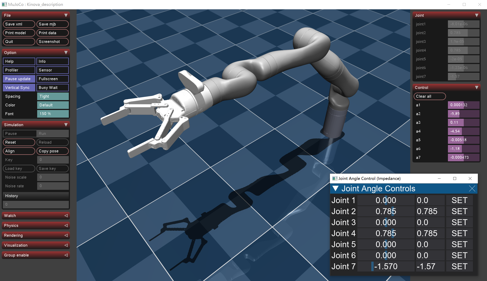
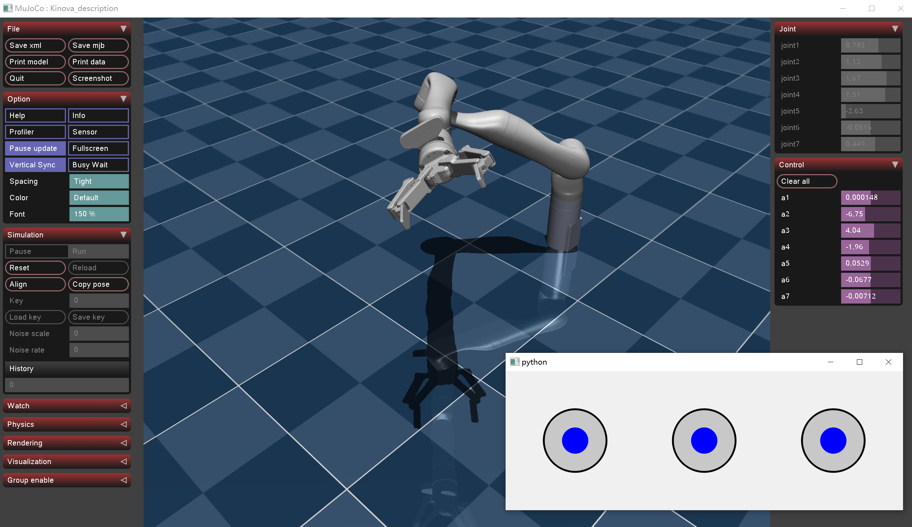

# Kinova7DoF-MuJoCo


This project is based on a Kinova robotic arm URDF converted to an MJCF format for MuJoCo simulation. It integrates Pinocchio for dynamic computations and develops demos for kinematics, trajectory interpolation, and control. The goal is to create a MuJoCo-based, cross-platform equivalent of MoveIt! for comprehensive motion planning and control.



## Setup Your Environments

It is recommended to use a conda environment. Here is an example of creating a new environment.
```shell
conda create --name Mujoco-Kinova python=3.10
conda activate Mujoco-Kinova

python.exe -m pip install --upgrade pip setuptools wheel
```
The corresponding dependencies need to be installed below; if all goes well, these two lines of commands should be sufficient.
```shell
# conda install pinocchio
conda install pinocchio -c conda-forge
# python requirements
pip install  mujoco dearpygui scipy numpy pandas matplotlib scikit-learn PyQt6 -i https://pypi.tuna.tsinghua.edu.cn/simple
```

## Latest Update

#### 25.03.11
In file ./Kinematics/Inverse_Demo/1_5_inverse_impedance_control.py, achieved together control of least_square based Kinematics and Pinocchio Dynamics

Further research will be conducted on 7-dof issue of multiple analytical solutions.


